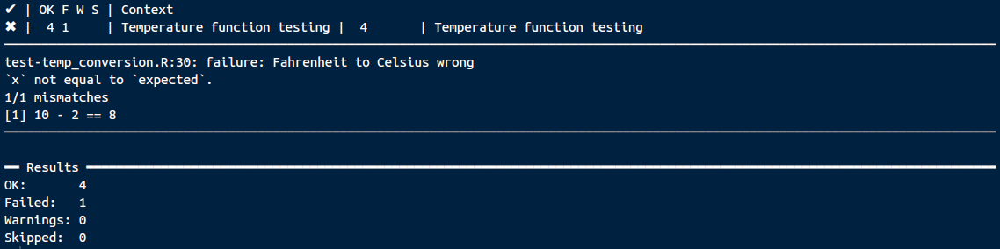

Contents
================================================================================

********************************************************************************

**After reading through this, you will have been introduced to the basic principles of writing tests for the code that you have written.**

********************************************************************************

- [Introduction: Why code testing?](#intro)
- [The testthat R package](#testthat) 
    - [What is the testthat package?](#whatis)
    - [How do I get started with testthat?](#howstart)
    - [Two simple functions that will be tested](#twosimp)
    - [The test_that function](#test_that)
    - [An R script for running testthat functions](#Rscript)
    - [Running all of the tests](#running)
    - [Putting it all together](#alltogether)
- [Additional resources](#whatelse)

********************************************************************************

<a name="intro">Introduction: Why code testing?</a>
================================================================================

Testing is an important part of the coding process. If you have ever written a function in R, then you already have some experience in testing code; checking to see whether or not the function 'works' is a type of informal test and part of the normal process of coding. But just because a function worked initially, does not necessarily mean that it will continue to work when something changes. An error might arise if you try (perhaps unknowingly) to use your function in a different way than originally intended (e.g., with a slightly different input type). And if you have written a lot of code for your model or data analysis, you will likely have several functions working together, making it difficult to pinpoint the cause of the error. By writing [unit tests](https://www.toptal.com/qa/how-to-write-testable-code-and-why-it-matters) -- which independently check small parts of your code to see that they work as intended -- you can often quickly identify (or rule out) where the problem lies. 

Writing tests as you code can also make coding more efficient and more fun. They encourage you code in manageable chunks and verify that each function you write is working as intended. This helps both with the planning and organisation of large data analyses and modelling projects. In R, it is also very satisfying and reassuring watching the code that you have written pass a long list of well-constructed unit tests. Here we will demonstrate how to use the [testthat R package](https://github.com/r-lib/testthat) in R, which is an easy way to get started with code testing. After reading through these notes, you should be able to write unit tests for your own code.

<a name="testthat">The testthat R package</a>
================================================================================

<a name="whatis">**What is the testthat package?**</a>

The [testthat R package](https://github.com/r-lib/testthat) is a helpful way to get started writing tests for the code that you write. Testing code is often boring and tedious, and it is usually very tempting to bypass this stage of the coding process entirely. Once you have code that works (often obtained only after a lot of hard work), you want to use it, not think about all of the ways that it could eventually fail. The [testthat R package](https://github.com/r-lib/testthat) tries to make testing as easy and interesting as possible, so that you will actually want to do it after you have finished coding something. It does this by minimising the amount of effort that goes into writing code tests and maximising how cool it is to watch all of your tests being passed. For example, here is what testing looks like for a reasonably sized [R package](https://confoobio.github.io/gmse/).

<center><br>

</center><br>

All of the 143 tests click through one by one to make sure that all of the functions in the package are working as intended. How does testthat determine that the functions are working as intended? Each individual test runs a function with a known input and output. The input is read into the argument's functions, and the output is examined by the test against some criteria, which could be some particular value, object type, or object size. Seeing this in practice below will make it clearer, but the general idea is that after writing the code, you know what the output *should* be for a particular input. As you continue to code more and regularly test, if that output changes or returns an error, then the automated process of testing with testthat will catch the problem and tell you what needs to be fixed.

<a name="howstart">**How do I get started with testthat?**</a>

The first thing that you need to do is install the [testthat R package](https://github.com/r-lib/testthat). This can be done from CRAN using the code below.

```{r, eval = FALSE, echo = TRUE}
install.packages("testthat")
```

Alternatively, you can download [testthat](https://github.com/r-lib/testthat) from GitHub if you have the [devtools](https://github.com/r-lib/devtools) R package installed.

```{r, eval = FALSE, echo = TRUE}
devtools::install_github("r-lib/testthat");
```

Once [testthat](https://github.com/r-lib/testthat) is installed, you can load it into Rstudio just like any other R package.

```{r, eval = TRUE, echo = TRUE}
library(testthat);
```

You are now ready to start writing R scripts to test the functions that you have written. First, however, we need to add some functions. I will use two simple temperature conversion functions written in a previous coding club session on [writing R packages](https://stirlingcodingclub.github.io/SCC_R_package/notebook/Rpackage_notes.html).

<a name="twosimp">**Two simple functions that will be tested**</a>

When you code, it is often a good idea to try to write short functions. There is no hard rule for determining when a function is too long, but whenever possible, it is usually best to avoid writing functions with too many lines to view all at once on your monitor. Small functions that do one job, which can be called by *other* functions as necessary, make coding easier later on because this allows you to compartmentalise specific tasks and better see how everything fits together at once ([here is](https://github.com/bradduthie/RandomMatrixStability/blob/master/R/ga.R) a good example of this in R code; [here is](https://github.com/bradduthie/EcoEdu/blob/master/R/sim_pop_gen.R) a bad example; and [here is](https://github.com/bradduthie/pre_post_cop/blob/master/code/Inbreed.c#L33) a *very* bad example; all of these work, but the first is much nicer to read and test). Small functions are also easier to test because it is clearer what output you are expecting for a particular function input. Many small functions (rather than a few large ones) also allow you to run more tests and better pinpoint the problem when something goes wrong.

Take the a simple [R script](https://github.com/StirlingCodingClub/SCC_R_package/blob/master/R/temp_conversion.R) with two custom R functions. The first function converts a temperature from Fahrenheit to Celsius.

```{r}
F_to_C <- function(F_temp){
    C_temp <- (F_temp - 32) * 5/9;
    return(C_temp);
}
```

The second function converts from Celsius to Fahrenheit.

```{r}
C_to_F <- function(C_temp){
    F_temp <- (C_temp * 9/5) + 32;
    return(F_temp);
}
```

It might not seem like there is much reason for testing these functions. They are both tiny, really only a single line of code doing the work. The maths can be checked by eye, and the function can likewise be checked easily by running a known temperature through each function and looking at the output (which you would naturally do after first writing the functions to double-check that they work). Nevertheless, if these functions were embedded within a much larger R script with other functions to process a large data set and run one or more analyses, an automated test to ensure that each is working as intended is probably worth writing. A test could of course check to make sure that the converted value returned is correct for some arbitrary temperature input, but you also might want to make sure that the output is being returned in a particular format; e.g., as a numeric -- or specifically as a value of type 'double' rather than an integer. For more complex functions, you might want to ensure that the *dimensions* of the output are correct (e.g., a matrix with a specific number of rows and columns, or a list with 3 elements of different types).

<a name="test_that">**The test_that function**</a>

We can use the `test_that` function of the [testthat package](https://github.com/r-lib/testthat) to write sime simple tests for the `F_to_C` and `C_to_F` functions written above. The `test_that` function follows a simple structure with two arguments: `desc` provides a description (in quotes) of whatever is being tested, and `code` provides whatever code (within curly brackets) to test. 

Within the bracketed code to be tested, one or more `expect_that` functions are run; each call to `expect_that` is an independent test. The `expect_that` function takes two arguments: `object` is the object that is being examined by the function and `condition` is the condition that the object is meant to satisfy. 

Below is a test of the `F_to_C` function. Note the description in quotes and the bracketed code. Within the test, the `F_to_C` function is run for the temperature of 50 degrees Fahrenheit and stored as `temp_C`. Since we know that the correct conversion from 50 degrees Fahrenheit to Celsius is `r F_to_C(50)`, we can run an `expect_that` to check that `temp_C` equals `r F_to_C(50)`.

```{r, eval = FALSE}
test_that(desc = "Fahrenheit to Celsius", code = {
  
  temp_C <- F_to_C(50); # Runs the function
  
  # Test that the result is the correct value
  expect_that( object = temp_C, condition = equals(10) );
  
  # Test that the result is numeric
  expect_that( object = is.numeric(temp_C), condition = equals(TRUE) );
})
```

We can do the same below to test the the `C_to_F` function in the opposite direction. We now that 10 degrees Celsius is equal to `r C_to_F(10)` degrees Fahrenheit, so we can set the test accordingly.

```{r, eval = FALSE}
test_that(desc = "Celsius to Fahrenheit", code = {
  
  temp_F <- C_to_F(10);
  
  # Test that the result is the correct value
  expect_that( object = temp_F, condition = equals(50) );
  
  # Test that the result is numeric
  expect_that( object = is.numeric(temp_F), condition = equals(TRUE) );
})
```

Setting up the tests above was the boring part. The fun part is running them all at once. You could also run them one by one, but this is not nearly as satisfying. If you were run the above tests for `F_to_C` or `C_to_F` in the R console, nothing would print off on your screen; this means that the test is passed. The test will only print something off if it fails, such as with the test below, which deliberately tests the incorrect conversion of Fahrenheit to Celsius.

```{r, eval = FALSE}
test_that(desc = "Fahrenheit to Celsius wrong", code = {
  temp_F <- F_to_C(50);
  expect_that( object = temp_F, condition = equals(2) );
})
```

To run a full list of tests and return a report, we need to save the above tests in an R script. 

<a name="Rscript">**An R script for running testthat functions**</a>

Test functions can be saved like any other R script file (with a .R extension), but with one caveat. A test R script should start with the prefix 'test-'. A good way of doing this is to add the prefix to the name of file that stores the functions to be tested. In other words, if you are testing the functions in the file [temp_conversion.R](https://github.com/StirlingCodingClub/code_testing/blob/master/temp_conversion.R), then you can save the tests in the file [test-temp_conversion.R](https://github.com/StirlingCodingClub/code_testing/blob/master/test-temp_conversion.R). Here is what the [test-temp_conversion.R](https://github.com/StirlingCodingClub/code_testing/blob/master/test-temp_conversion.R) file looks like.

```{r, eval = FALSE}
library(testthat);
context("Temperature function testing");
source("temp_conversion.R");

test_that("Fahrenheit to Celsius", {
  
  temp_C <- F_to_C(50);
  
  # Test that the result is numeric
  expect_that( is.numeric(temp_C), equals(TRUE) );
  
  # Test that the result is the correct value
  expect_that( temp_C, equals(10) );
})

test_that("Celsius to Fahrenheit", {
  
  temp_F <- C_to_F(10);
  
  # Test that the result is numeric
  expect_that( is.numeric(temp_F), equals(TRUE) );
  
  # Test that the result is the correct value
  expect_that( temp_F, equals(50) );
})

# This test will fail
test_that(desc = "Fahrenheit to Celsius wrong", code = {
    temp_F <- F_to_C(50);
    expect_that( object = temp_F, condition = equals(2) );
})
```

Note the first few lines of the file. The first line reads in the testthat R package. The second line provides some sort of title for the type of tests being run (in this case test of temperature functions). The context is important to specify due to an [unusual bug](https://github.com/r-lib/testthat/issues/700#issuecomment-367675035) that still appears unresolved in testthat; hence the context is mandatory. The `source` function reads in the functions to be tested; make sure that the correct directory is specified here and in R studio. For these example files, the working directory of Rstudio should be set to wherever the 'code_testing' folder is on your computer. Since both [test-temp_conversion.R](https://github.com/StirlingCodingClub/code_testing/blob/master/test-temp_conversion.R) and [temp_conversion.R](https://github.com/StirlingCodingClub/code_testing/blob/master/temp_conversion.R) are located immediately inside this directory (and not within other folders within it), running `source("temp_conversion.R")` should run all of the code in the [temp_conversion.R](https://github.com/StirlingCodingClub/code_testing/blob/master/temp_conversion.R) file (if, e.g., the file was located in a folder called 'R', ). In other words, after `source("temp_conversion.R")`, the `F_to_C` and `C_to_F` functions should be read into R and ready to use by testthat.

After the testthat library is read in, the context established, and the functions to be tested sourced from the correct file, the tests themselves are added to the script. Any number of tests is permitted in a test script, and any number of scripts can be saved to the same directory. The automated test procedure will simply look for anything with the prefix 'test-' and extension '.R' in a directory and run all of the tests.

<a name="running">**Running all of the tests**</a>

To run all of the tests, first make sure that R is in the correct directory (i.e., the same folder location as the test scripts). You can always check the working directory with the command below.

```{r, eval = FALSE}
getwd();
```

If the directory needs to be changed, you can specify with `setwd("path/to/directory")`, or use the Rstudio tool bar, going to <u>S</u>ession > Set <u>W</u>orking Directory. Once you are in the correct location, you can run all of the tests in the directory with one command.

```{r, eval = FALSE}
test_dir(".");
```

Recall that in the [test-temp_conversion.R](https://github.com/StirlingCodingClub/code_testing/blob/master/test-temp_conversion.R) file, there were five total tests in three `test_that` functions. The first four tests within the first two functions should pass, but the last test "Fahrenheit to Celsius wrong" was deliberately set to fail. Here is what the output of `test_dir` looks like.

<center><br>

</center><br>

As expected, the first four tests passed, while the last test failed. The failed test is tallied in the Results, and an explanation of the fail is flagged between two horizontal rules. 

<a name="alltogether">**Putting it all together**</a>

With tests in place, the `test_dir` function can be run at any time during the coding process. As you continue to write new R scripts and use and re-use R functions, testing frequently is an excellent way to spot bugs early and pinpoint what needs to be fixed. Doing this will make it much less likely that changing your code will unintentionally cause an error, forcing you to backtrack to figure out what went wrong. Hadley Wickham also [points out that](http://r-pkgs.had.co.nz/tests.html) having multiple unit tests will also improve your coding by forcing you to write smaller, more manageable functions. He also suggests, as a strategy, starting to code by writing tests that you know will fail, and working until they pass. For example, when you find a bug with your code, write a test that you know will fail until the bug is fixed. For more information, see Hadley Wickham's [chapter on testing](http://r-pkgs.had.co.nz/tests.html).

<a name="whatelse">Additional resources</a>
================================================================================


- [Example of unit testing R code with testthat](https://www.johndcook.com/blog/2013/06/12/example-of-unit-testing-r-code-with-testthat/) (John D. Cook)
- [Testing R packages](http://r-pkgs.had.co.nz/tests.html) (Hadley Wickam)
