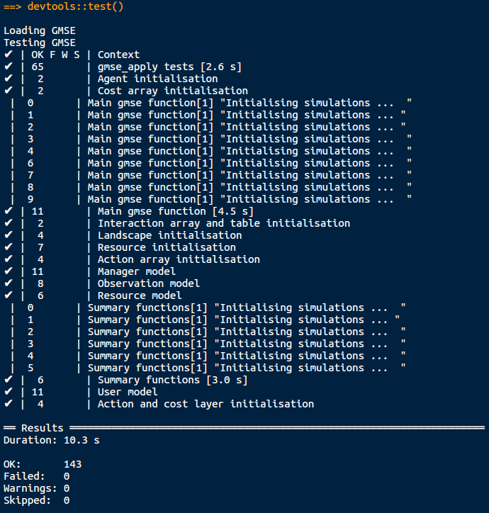

```{r, echo = FALSE}
library(knitr);
opts_chunk$set(echo = FALSE);
```

## Introduction: Why bother testing your code?

Good question. I need to flesh this out a bit.


## Testing all of your code at once is satisfying

<center><br>

</center><br>

## Getting started: install the testthat package

Can install [testthat](https://github.com/r-lib/testthat) from [CRAN](https://cran.r-project.org/).

```{r, eval = FALSE, echo = TRUE}
install.packages("testthat")
```

**Or** install from GitHub with the [devtools](https://github.com/r-lib/devtools) R package.

```{r, eval = FALSE, echo = TRUE}
devtools::install_github("r-lib/testthat");
```

Load [testthat](https://github.com/r-lib/testthat) into Rstudio just like any other R package.

```{r, eval = TRUE, echo = TRUE}
library(testthat);
```

## Two simple functions to be tested

**Consider one [R script](https://github.com/StirlingCodingClub/SCC_R_package/blob/master/R/temp_conversion.R) (file with .R extension) with functions.**

\hrule \vspace{3 mm}

*Function 1*: converts a temperature from Fahrenheit to Celsius.

```{r, echo = TRUE}
F_to_C <- function(F_temp){
    C_temp <- (F_temp - 32) * 5/9;
    return(C_temp);
}
```

\pause

*Function 2*: converts from Celsius to Fahrenheit. 

```{r, echo = TRUE}
C_to_F <- function(C_temp){
    F_temp <- (C_temp * 9/5) + 32;
    return(F_temp);
}
```


## Two simple functions to be tested

**Consider one [R script](https://github.com/StirlingCodingClub/SCC_R_package/blob/master/R/temp_conversion.R) (file with .R extension) with functions.**

\hrule \vspace{3 mm}

*Function 1*: converts a temperature from Fahrenheit to Celsius.

```{r, echo = TRUE}
F_to_C(50)
```

\pause

*Function 2*: converts from Celsius to Fahrenheit.

```{r, echo = TRUE}
C_to_F(10)
```


## How the `test_that` function works

Example of a testthat R script, < [test-temp_conversion.R](https://github.com/StirlingCodingClub/code_testing/blob/master/test-temp_conversion.R) >

```{r, echo = TRUE, eval = FALSE}
library(testthat);
context("Temperature function testing");
source("temp_conversion.R"); # Functions to test

test_that("Fahrenheit to Celsius", {
  
  temp_C <- F_to_C(50);
  
  # Test that the result is numeric
  expect_that( is.numeric(temp_C), equals(TRUE) );
  
  # Test that the result is the correct value
  expect_that( temp_C, equals(10) );
})
```


